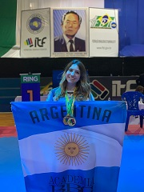
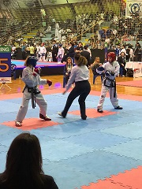

# Hola! Soy Celeste Dellisola

## Buenas! Bueno como dice arriba, me llamo Celeste y tengo 19 años. 

- Algo interesante por decirlo así que pueda contar sobre mi es que desde muy chiquita (desde los 5 años) hago Taekwondo ITF, actualmente soy Cinturon Negro 3er Dan y hace pocos años comence Kick Boxing. 
- El año pasado gracias a la ayuda de mis papas pude participar del Centro Sudamericano en Brasil y de la Copa del Mundo en Eslovenia. Mis dos grandes objetivos de este año es poder viajar al Panamericano que se realiza acá (por suerte) en Argentina y en el Mundial de Taekwondo que se realizará en Finlandia!
- Gracias por querer conocer y descubrir una pequeña partecita de mi ! Buena semana :)

- En esta última foto... muestro un poco de lo mucho que pude disfrutar de vivir esta experiencia de la mano de mi papa y mi hermano menor... compartir esta pasion con ellos es una de las mejores cosas que me pudo pasar! Y agradecer tambien a mi mama de lo mucho que nos apoya desde afuera del Tatami, grabandonos, gritando y alentandonos como la mejor :)
